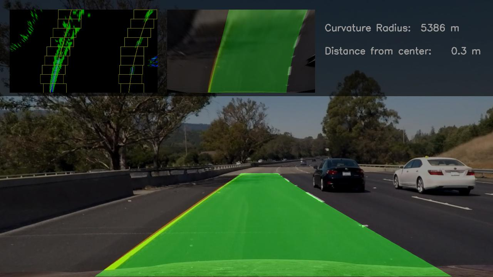

# Finding Lanes

Reuse of my UDACITY ND Self-Driving-Cars project to find lanes in a given video stream.
Goal is to adapt the code to run on a livestream from a dash cam in my own car.

Hardware planned to be used: Raspberry PI or Jetson Nano.

